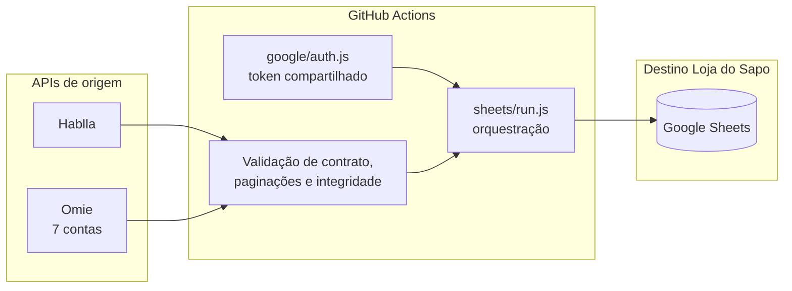
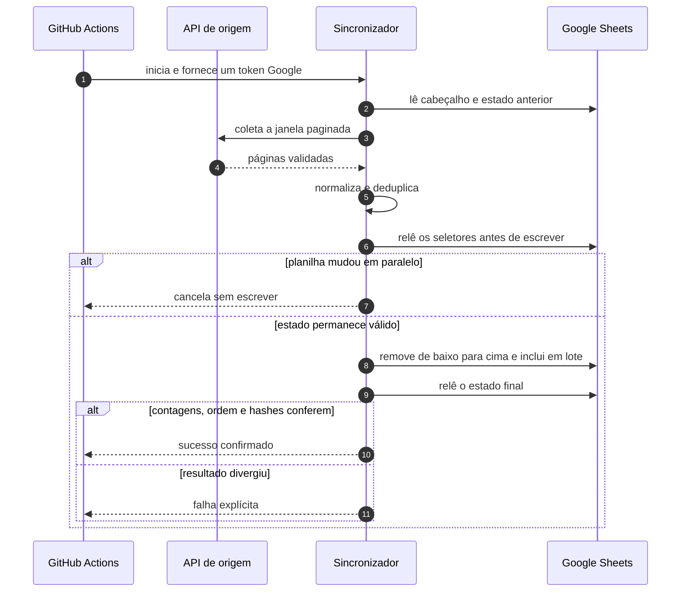
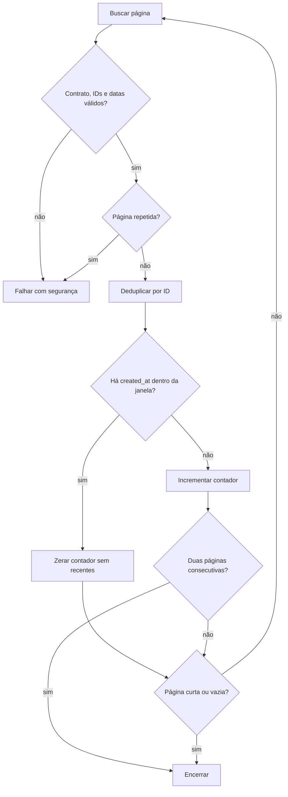
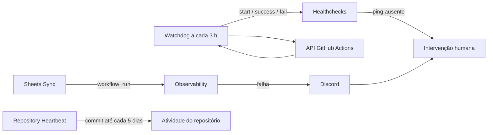

# Loja do Sapo Data

[](https://github.com/lojadosapo/ls-data/actions/workflows/tests.yml)
[](https://github.com/lojadosapo/ls-data/actions/workflows/sheets-sync.yml)
[](https://github.com/lojadosapo/ls-data/actions/workflows/observability.yml)

> [!IMPORTANT]
> Este é o repositório central das automações de dados da **Loja do Sapo**. Ele escreve exclusivamente nas planilhas Google da empresa. Não há envio ao Supabase neste projeto.

O `ls-data` coleta dados do **Hablla** e de sete contas **Omie**, substitui apenas a janela recente das planilhas e valida o resultado antes de considerar a execução concluída.

## Visão geral



### Garantias operacionais

- **Empresas separadas:** credenciais e destinos pertencem somente à Loja do Sapo.
- **Sem duplicação silenciosa:** IDs coletados são deduplicados e a janela anterior é substituída.
- **Sem perda silenciosa:** respostas, páginas, datas, cabeçalhos e larguras são validados.
- **Concorrência protegida:** o estado da planilha é relido imediatamente antes da escrita.
- **Falha segura:** respostas malformadas, páginas repetidas ou resultado final divergente encerram o workflow com erro.
- **Logs públicos mínimos:** não são registrados tokens, payloads, nomes, e-mails ou dados de clientes.

## Rotas de dados

| Origem | Abas de destino | Estratégia |
|---|---|---|
| Hablla | `Base Hablla Card` | Mantém a janela recente de cards; deduplica por ID. |
| Hablla | `Base Atendente` | Substitui os dias processados; resolve colaboradores pela base auxiliar. |
| Omie | `Produtos e Servicos` | Recalcula a janela das sete contas e substitui as linhas em lote. |
| Omie | `Vendedor` | Atualiza no mesmo lote atômico da aba de produtos e serviços. |

> [!NOTE]
> Linhas visualmente iguais do Omie podem representar eventos distintos. Como a origem não fornece uma chave estável para todos esses casos, o fluxo não elimina essas linhas apenas pela igualdade dos campos.

## Agendamentos

Os crons usam UTC; os horários locais abaixo usam `America/Sao_Paulo`.

| Workflow | Cron UTC | Horários BRT | Função |
|---|---:|---:|---|
| `Sheets Sync` | `47 4,10,16,22 * * *` | 01:47, 07:47, 13:47, 19:47 | Omie e Hablla → Sheets. |
| `Observability` | `41 */3 * * *` com timezone BRT | a cada 3 horas, minuto 41 | Detecta falhas, atrasos e workflows desabilitados. |
| `Repository Heartbeat` | no máximo a cada 5 dias | 04:29 | Cria atividade real na branch principal. |
| `Tests` | push, pull request e manual | sob demanda | Executa `node --test`. |

Todos os workflows também aceitam `workflow_dispatch` quando uma validação manual for necessária.

## Escrita segura no Sheets



Uma escrita que perdeu a resposta por timeout não é repetida cegamente. O código consulta primeiro o estado final para distinguir “não aplicado” de “aplicado com resposta perdida”.

Strings são enviadas como texto literal, sem adicionar apóstrofo ao conteúdo e sem executar fórmulas. Datas do Hablla e do Omie continuam sendo células numéricas com formato `DATE`/`DATE_TIME`, preservando filtros, fórmulas e Apps Script que esperam datas reais.

## Paginação otimizada do Hablla

Cards são pedidos em páginas de 50, ordenados por `updated_at` decrescente. A janela de negócio continua sendo determinada por `created_at`.



O coletor preserva o comportamento histórico: encerra depois de **duas páginas consecutivas** sem card criado no prazo e zera o contador quando encontra uma criação recente. `updated_at` pagina a API; somente `created_at` decide quais cards pertencem à janela. IDs, datas, páginas repetidas e o teto total continuam validados antes de qualquer escrita.

## Resiliência

| Integração | Proteções |
|---|---|
| Google Auth | JWT de service account, token compartilhado, renovação antecipada e renovação única após `401`. |
| Google Sheets | Retry de leituras para rede, `408`, `429`, `5xx` e quota `403`; conferência exata após escrita. |
| Hablla | Reautenticação, backoff, intervalo mínimo, contratos explícitos e teto de páginas. |
| Omie | Rate limit por conta e global, concorrência limitada, cache, deduplicação em voo e circuit breaker para HTTP `425`. |

## Observabilidade e autonomia



O watchdog monitora apenas os fluxos de produção existentes: `Sheets Sync` e `Repository Heartbeat`. Configure estes GitHub Secrets para alertas externos:

- `DISCORD_WEBHOOK_URL`: recebe falhas imediatas e atrasos, sem payload de negócio;
- `HEALTHCHECKS_PING_URL`: detecta inclusive a ausência completa de execuções do GitHub Actions.

Sem esses valores, falhas continuam visíveis na aba Actions, mas não existe um canal externo completo de dead-man.

## Estrutura

```text
.
├── .github/
│   ├── workflow-health.json
│   └── workflows/
├── ops/
│   └── heartbeat.txt
├── scripts/
│   └── health.js
├── src/
│   ├── google/
│   │   ├── auth.js
│   │   └── sheets.js
│   ├── hablla/
│   │   ├── api.js
│   │   ├── card-collector.js
│   │   ├── date-range.js
│   │   ├── response-contracts.js
│   │   └── sheets/
│   │       └── sync.js
│   ├── omie/
│   │   ├── api.js
│   │   └── sheets/
│   │       └── sync.js
│   ├── sheets/
│   │   └── run.js
│   └── lib/
└── test/
```

Esta página é a única documentação operacional do projeto; não crie READMEs por pasta.

## Configuração

Use Node.js 24 e instale exatamente o lockfile:

```bash
npm ci
npm test
```

### Secrets de produção

| Grupo | Nomes |
|---|---|
| Google | `GOOGLE_CLIENT_EMAIL`, `GOOGLE_PRIVATE_KEY` |
| Hablla | `HABLLA_TOKEN`, `HABLLA_EMAIL`, `HABLLA_PASSWORD`, `HABLLA_WORKSPACE_ID`, `HABLLA_BOARD_ID`, `HABLLA_SPREADSHEET_ID`, `HABLLA_COLLABORATORS_SPREADSHEET_ID` |
| Omie | `OMIE_CREDENTIALS`, `OMIE_SHEETS_SPREADSHEET_ID` |
| Operação | `DISCORD_WEBHOOK_URL`, `HEALTHCHECKS_PING_URL` |

### Ajustes opcionais

| Variável | Padrão | Efeito |
|---|---:|---|
| `OMIE_SHEETS_DAYS` | `7` | Janela recalculada no Sheets. |
| `HABLLA_CARDS_DAYS` | `7` | Janela recente de cards. |
| `HABLLA_CARDS_MAX_PAGES` | `2000` | Teto seguro da paginação. |
| `HABLLA_CARDS_PAGES_WITHOUT_RECENT_CREATED` | `2` | Páginas consecutivas sem criação recente antes do encerramento. |
| `HABLLA_MIN_INTERVAL_MS` | `500` | Ritmo mínimo das chamadas Hablla. |
| `HABLLA_REQUEST_TIMEOUT_MS` | `60000` | Timeout HTTP do Hablla. |
| `HABLLA_MAX_ATTEMPTS` | `5` | Tentativas transitórias no Hablla. |
| `OMIE_MIN_INTERVAL_MS` | `275` | Intervalo por conta e método. |
| `OMIE_GLOBAL_MIN_INTERVAL_MS` | `70` | Intervalo global entre chamadas Omie. |
| `OMIE_MAX_CONCURRENCY` | `3` | Máximo de chamadas Omie simultâneas. |
| `OMIE_REQUEST_TIMEOUT_MS` | `60000` | Timeout HTTP do Omie. |
| `OMIE_425_COOLDOWN_MS` | `1800000` | Pausa mínima do circuit breaker. |
| `OMIE_425_MAX_ATTEMPTS` | `3` | Bloqueios `425` antes de falhar. |
| `OMIE_MAX_PAGES` | `10000` | Teto das paginações Omie. |
| `GOOGLE_SHEETS_READ_TIMEOUT_MS` | `180000` | Timeout de leituras grandes. |
| `GOOGLE_SHEETS_READ_MAX_ATTEMPTS` | `5` | Tentativas de leitura transitória. |
| `SYNC_SCRIPT_MAX_ATTEMPTS` | `1` | Evita repetir uma sincronização inteira. |

## Execução manual

Carregue um `.env` protegido e execute:

```bash
node src/sheets/run.js omie/sheets/sync.js hablla/sheets/sync.js
```

O orquestrador obtém um token Google e o compartilha com os dois sincronizadores. Antes de executar contra produção, confirme que não existe outro run do grupo `sheets-sync` em andamento.

## Runbook

### 🟢 Saudável

- `Sheets Sync` terminou com sucesso dentro das últimas 11 horas;
- o watchdog está verde e o Healthchecks recebeu seu ping;
- não há divergência na validação pós-escrita;
- o heartbeat tem menos de 144 horas.

### 🔴 Intervenção necessária

1. Abra o run indicado no alerta.
2. Confira o resumo sanitizado: autenticação, contrato, paginação, limite da API ou validação do destino.
3. Para `401`/`403`, confirme a validade e a permissão do secret sem expor seu valor.
4. Para Omie `425`, respeite a pausa do circuit breaker; não empilhe execuções manuais.
5. Para alteração concorrente da planilha, espere o outro escritor terminar e execute uma vez.
6. Depois da correção, use `workflow_dispatch` uma vez e confirme o novo sucesso.

## Política de logs

Este repositório é público. Nunca registre tokens, chaves, URLs de webhook, payloads completos, nomes, telefones, e-mails ou IDs reais de clientes. Logs devem conter somente provedor, operação, status genérico, tentativa, duração e contagens agregadas.

## Licença

Consulte [LICENSE](LICENSE).
