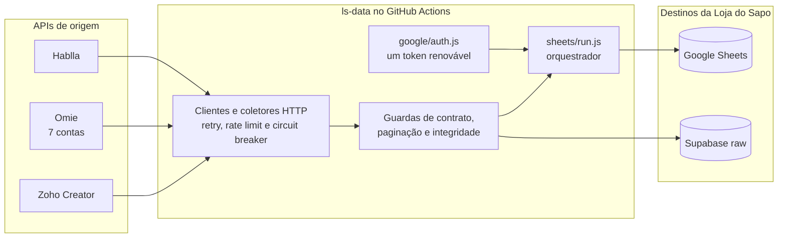
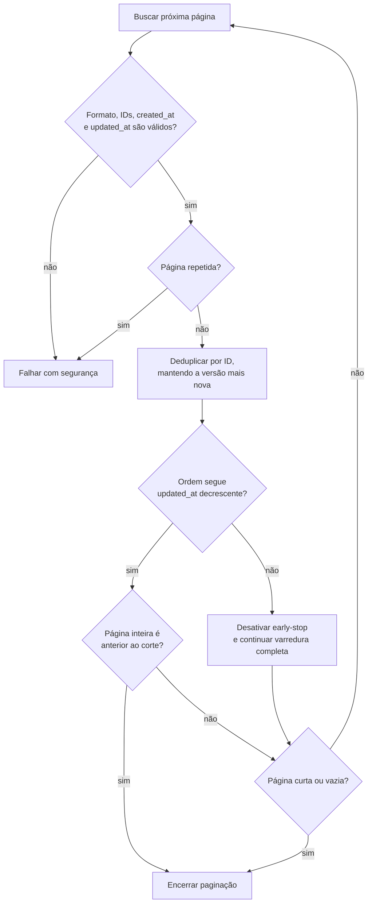
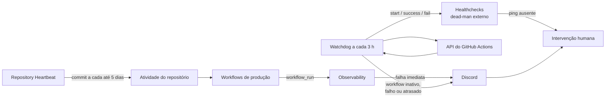

# Loja do Sapo Data

[](https://github.com/lojadosapo/ls-data/actions/workflows/tests.yml)
[](https://github.com/lojadosapo/ls-data/actions/workflows/sheets-sync.yml)
[](https://github.com/lojadosapo/ls-data/actions/workflows/observability.yml)

> [!IMPORTANT]
> Este é o repositório central das automações de dados da **Loja do Sapo**. Credenciais, destinos e telemetria pertencem exclusivamente a esta empresa.

Este projeto coleta dados de **Hablla**, **Omie** e **Zoho**, mantém janelas recentes no **Google Sheets** e grava eventos brutos no **Supabase**. A implementação foi desenhada para operar sem supervisão diária, interromper escritas duvidosas e avisar quando uma intervenção humana for necessária.

## Visão geral



### Garantias operacionais

- **Escopo controlado:** cada rotina conhece seu provedor, sua janela de datas e seu destino.
- **Atualização idempotente:** o Supabase usa `upsert` por `external_id`; as planilhas substituem somente a janela recalculada.
- **Sem duplicação silenciosa:** IDs são deduplicados durante a coleta e o estado final é relido após a escrita.
- **Sem perda silenciosa:** respostas, páginas, IDs, datas, cabeçalhos e larguras são validados antes de aceitar os dados.
- **Concorrência protegida:** workflows do mesmo recurso usam grupos de concorrência; o Sheets confirma que outro processo não alterou as linhas antes da escrita.
- **Falha segura:** quando a API responde em formato inesperado, repete uma página, ultrapassa um teto ou deixa uma escrita ambígua, a execução falha em vez de assumir sucesso.
- **Logs públicos mínimos:** métricas operacionais podem aparecer; credenciais, payloads completos e dados identificáveis não.

## Rotas de dados

| Provedor | Destino | Conjunto | Estratégia |
|---|---|---|---|
| Hablla | Google Sheets | `Base Hablla Card` (18 colunas) | Substitui cards da janela recente e qualquer ID retornado novamente. |
| Hablla | Google Sheets | `Base Atendente` (17 colunas) | Substitui o dia processado; nomes vêm de `Base_de_Colaboradores`. |
| Hablla | Supabase | `raw_events_hablla` | `upsert` por `card-<id>`. |
| Hablla | Supabase | `raw_contact_hablla` | `upsert` por `client-<id>`. |
| Hablla | Supabase | `raw_cs_avaliacao_atendimento` | Reconciliação por dia, setor, atendente e conexão. |
| Omie | Google Sheets | `Produtos e Servicos` e `Vendedor` | Recalcula a janela das sete contas e troca as linhas em um único lote atômico. |
| Omie | Supabase | `raw_omie_vendas_nfe`, `raw_omie_servicos_nfse`, `raw_omie_financas` | Coleta sequencial diária das sete contas, com `upsert` idempotente. |
| Zoho Creator | Supabase | `raw_events_ordem_de_servico` | `upsert` por ID da ordem, com rotinas de 7 e 15 dias. |

Os registros `raw` preservam o objeto entregue pelo provedor. Normalizações, cruzamentos e enriquecimentos devem ocorrer depois dessa camada, sem reescrever o evento bruto.

## Agendamentos de produção

Os crons de dados abaixo são interpretados em **UTC** pelo GitHub. BRT corresponde a `America/Sao_Paulo` (UTC−3). Todos também aceitam execução manual por `workflow_dispatch`.

| Provedor / destino | Workflow | Cron UTC | Horários BRT | Comando |
|---|---|---:|---:|---|
| Hablla → Supabase, cards | `Hablla Cards` | `7 3,9,15,21 * * *` | 00:07, 06:07, 12:07, 18:07 | `node src/hablla/supabase/cards.js` |
| Hablla → Supabase, clientes | `Hablla Clients` | `18 3,9,15,21 * * *` | 00:18, 06:18, 12:18, 18:18 | `node src/hablla/supabase/clients.js` |
| Hablla → Supabase, atendentes | `Hablla Attendants` | `13 6 * * *` | 03:13 | `node src/hablla/supabase/attendants.js` |
| Omie + Hablla → Sheets | `Sheets Sync` | `47 4,10,16,22 * * *` | 01:47, 07:47, 13:47, 19:47 | `node src/sheets/run.js omie/sheets/sync.js hablla/sheets/sync.js` |
| Omie → Supabase | `Omie Supabase` | `31 6 * * *` | 03:31 | `node src/omie/supabase/run.js` |
| Zoho → Supabase, últimos 7 dias | `Zoho Service Order Recent` | `23 5,11,17,23 * * *` | 02:23, 08:23, 14:23, 20:23 | `node src/zoho/supabase/service-order-recent.js` |
| Zoho → Supabase, últimos 15 dias | `Zoho Service Order` | `2 15 * * *` | 12:02 | `node src/zoho/supabase/service-order.js` |

> [!NOTE]
> O horário de início de um workflow agendado não é uma promessa de execução no segundo exato. Os minutos quebrados reduzem a disputa com crons concentrados no início da hora, e o watchdog usa tolerâncias maiores que o intervalo nominal.

### Rotinas operacionais

| Workflow | Frequência | Função |
|---|---|---|
| `Tests` | `push`, pull request e manual | Executa a suíte `node --test`. |
| `Observability` | A cada 3 horas, no minuto 41 (BRT), e após falhas | Verifica estado e idade dos workflows; publica resumo e alerta. |
| `Repository Heartbeat` | No máximo a cada 5 dias, às 04:29 BRT | Atualiza `ops/heartbeat.txt` e cria atividade real no repositório. |

## Atualização segura das planilhas

Apagar uma janela e acrescentá-la novamente é seguro apenas se a leitura usada para calcular os índices ainda for atual. Por isso, a sincronização valida o estado antes **e** depois da escrita.

```mermaid
sequenceDiagram
    autonumber
    participant A as GitHub Actions
    participant P as API do provedor
    participant S as Sincronizador
    participant G as Google Sheets

    A->>S: inicia rotina e obtém um token Google
    S->>G: lê cabeçalho, seletores e estado anterior
    S->>P: coleta a janela paginada
    P-->>S: páginas validadas
    S->>S: normaliza, deduplica e valida larguras
    S->>G: relê os seletores imediatamente antes da escrita
    alt planilha mudou em paralelo
        S-->>A: cancela sem escrever
    else estado continua igual
        S->>G: remove de baixo para cima e insere em lote
        S->>G: relê cabeçalho, janela e linhas não afetadas
        alt hashes, quantidades e valores conferem
            S-->>A: sucesso confirmado
        else estado final divergiu
            S-->>A: falha explícita; próxima execução pode reparar
        end
    end
```

### Como a duplicação é evitada

1. A rotina calcula a janela em `America/Sao_Paulo`.
2. As linhas antigas dessa mesma janela são localizadas por data, empresa e/ou identificador.
3. Páginas e itens repetidos são detectados; os registros coletados são deduplicados por ID.
4. A planilha é relida antes de usar índices físicos de linha.
5. As remoções ocorrem de baixo para cima e as inclusões entram no mesmo `batchUpdate` quando o fluxo é Omie.
6. Após a escrita, o código compara integralmente as linhas substituídas; nas linhas preservadas, confere quantidade, ordem e hash das colunas seletoras sem reler a planilha inteira.

Uma resposta de escrita perdida por timeout não é repetida cegamente: primeiro o estado final é consultado. Operações de acréscimo potencialmente duplicáveis têm uma única tentativa.

## Paginação otimizada do Hablla

O endpoint de cards é consultado em páginas de 50, solicitando `order=updated_at` e `direction=desc`. A janela de negócio continua sendo `created_at`, como no worker histórico; `updated_at` serve para ordenar a busca e provar quando as páginas seguintes já não podem conter um card criado dentro do prazo.



O worker histórico da Loja do Sapo encerrava após **duas páginas consecutivas** sem `created_at` dentro do prazo. A regra atual mantém a mesma semântica de criação, mas troca esse número heurístico por uma condição verificável:

- inclui somente cards cujo `created_at` pertence à janela;
- mantém o ganho de velocidade enquanto a ordenação descendente observada é confiável;
- encerra na primeira página inteiramente anterior ao corte de `updated_at`;
- se detectar qualquer inversão de ordem, abandona o atalho e continua até página curta/vazia;
- falha ao atingir `HABLLA_CARDS_MAX_PAGES`, em vez de aceitar uma coleta parcial.

## Resiliência por integração

| Componente | Proteções principais | O que não é repetido cegamente |
|---|---|---|
| Google Auth | JWT de service account; token compartilhado pelo orquestrador; renovação antecipada; renovação única após `401`; chamadas concorrentes aguardam a mesma renovação. | Não gera um token para cada sincronizador. |
| Google Sheets | Backoff para rede, `408`, `429`, `5xx` e quota `403`; timeouts maiores para planilhas grandes; validação exata após escrita. | `append` e lote com efeito relativo não são reenviados após resposta ambígua. |
| Hablla | Reautenticação com e-mail/senha quando o token expira; retry com backoff; ritmo mínimo; contratos explícitos e teto de páginas. | Resposta `200` malformada nunca é tratada como lista vazia. |
| Omie | Sete contas; somente métodos de leitura; intervalo mínimo de 275 ms por conta+método e 70 ms global; até 3 chamadas simultâneas; cache, deduplicação em voo e um grupo de concorrência comum entre Sheets e Supabase. | Um método mutável é recusado e dois workflows Omie não rodam ao mesmo tempo. |
| Omie HTTP 425 | Circuit breaker por conta+método; respeita `Retry-After`, usa pausa mínima padrão de 30 minutos e encerra após três bloqueios persistentes. | Chamadas enfileiradas não atravessam um circuito recém-aberto nem consomem todo o timeout do workflow. |
| Zoho | OAuth centralizado; validação do código de “sem dados”; progresso por IDs; teto de páginas e detecção de página sem avanço. | Um objeto vazio ou uma página repetida não encerra como sucesso. |
| Supabase | Lotes com `upsert`; retry para rede, `408`, `429` e `5xx`; conflito por `external_id`. | Erros permanentes de autenticação/contrato não entram em loop. |

## Observabilidade e autorrecuperação



Há três camadas complementares:

1. **Alerta imediato:** uma conclusão diferente de `success` dispara o modo `completion` e tenta notificar o Discord.
2. **Watchdog de atualidade:** `scripts/health.js watchdog` consulta a API do GitHub, confirma que cada workflow está ativo e compara o último sucesso com os limites de `.github/workflow-health.json`.
3. **Dead-man externo:** o Healthchecks recebe pings de início, sucesso e falha. Se o próprio GitHub Actions parar de executar, a ausência do ping ainda pode gerar alerta fora do GitHub.

O `Repository Heartbeat` evita depender de atividade humana: ele atualiza apenas `ops/heartbeat.txt` usando o `GITHUB_TOKEN` efêmero e restrito ao próprio repositório. Isso cria um commit real na branch principal sem compartilhar credenciais com outra empresa.

> [!WARNING]
> O monitor considera o heartbeat atrasado após 144 horas; se todos os Actions deixarem de executar, é o Healthchecks que precisa avisar.

### Alertas que precisam ser configurados

Estes nomes são GitHub Secrets; nunca coloque seus valores no repositório:

- `DISCORD_WEBHOOK_URL`: canal privado que receberá falhas imediatas e alertas de atraso.
- `HEALTHCHECKS_PING_URL`: URL exclusiva de um check com período compatível com o watchdog de 3 horas.

Sem Discord, a falha continua visível no Actions. Sem Healthchecks, não existe detecção externa caso o Actions inteiro pare. Ative também as notificações do GitHub Actions para execuções com falha como canal secundário.

### Pré-requisito do Omie no Supabase

Antes da primeira execução de `Omie Supabase`, execute [`supabase/schema.sql`](supabase/schema.sql) no SQL Editor do projeto Supabase da Loja do Sapo. O arquivo cria as três tabelas `raw_omie_*`, concede acesso ao `service_role` e adiciona os índices. Um erro `PGRST205` indica que essa migração ainda não foi aplicada.

## Estrutura do projeto

Os arquivos usam nomes curtos porque o diretório já informa o contexto:

```text
.
├── .github/
│   ├── workflow-health.json       # limites de idade por workflow
│   └── workflows/                 # agenda, testes, heartbeat e observabilidade
├── ops/
│   └── heartbeat.txt              # atividade automática versionada
├── scripts/
│   └── health.js                  # watchdog e alerta de conclusão
├── src/
│   ├── google/
│   │   ├── auth.js                # autenticação e renovação de token
│   │   └── sheets.js              # cliente e escrita segura no Sheets
│   ├── sheets/
│   │   └── run.js                 # orquestra todos os syncs solicitados
│   ├── hablla/
│   │   ├── api.js                 # cliente HTTP e reautenticação
│   │   ├── attendant-rows.js      # identidade composta e reconciliação
│   │   ├── card-collector.js      # paginação otimizada e deduplicação
│   │   ├── date-range.js          # janelas em America/Sao_Paulo
│   │   ├── response-contracts.js  # contratos das respostas
│   │   ├── sheets/
│   │   │   └── sync.js
│   │   └── supabase/
│   │       ├── attendants.js
│   │       ├── cards.js
│   │       └── clients.js
│   ├── omie/
│   │   ├── api.js                 # rate limit, cache, retry e circuito 425
│   │   ├── sheets/
│   │   │   └── sync.js
│   │   └── supabase/
│   │       ├── financas.js
│   │       ├── run.js             # executa as três coletas em sequência
│   │       ├── servicos-nfse.js
│   │       ├── sync.js            # coletor comum
│   │       └── vendas-nfe.js
│   ├── zoho/
│   │   ├── api.js
│   │   ├── oauth.js
│   │   ├── response.js
│   │   └── supabase/
│   │       ├── service-order.js
│   │       ├── service-order-recent.js
│   │       └── service-order-sync.js
│   └── lib/                        # retry, datas BRT, paginação, erros e upsert
├── test/                           # testes unitários e de resiliência
├── .env.example                    # catálogo sem valores reais
└── run-local.js                    # executor local dos coletores Supabase
```

Não crie READMEs por pasta. Esta página é a fonte única de documentação operacional.

## Configuração

Use **Node.js 24** e instale exatamente o lockfile:

```bash
npm ci
npm test
```

Copie `.env.example` para um `.env` **fora do controle de versão**. Os nomes abaixo são a interface de configuração; valores reais ficam apenas no GitHub Secrets ou no arquivo local protegido.

### Secrets de produção

| Grupo | Nomes |
|---|---|
| Google | `GOOGLE_CLIENT_EMAIL`, `GOOGLE_PRIVATE_KEY` |
| Supabase | `SUPABASE_URL`, `SUPABASE_SERVICE_ROLE_KEY` |
| Hablla | `HABLLA_TOKEN`, `HABLLA_EMAIL`, `HABLLA_PASSWORD`, `HABLLA_WORKSPACE_ID`, `HABLLA_BOARD_ID`, `HABLLA_SPREADSHEET_ID`, `HABLLA_COLLABORATORS_SPREADSHEET_ID` |
| Omie | `OMIE_CREDENTIALS`, `OMIE_SHEETS_SPREADSHEET_ID` |
| Zoho | `ZOHO_CLIENT_ID`, `ZOHO_CLIENT_SECRET`, `ZOHO_REFRESH_TOKEN`, `ZOHO_ACCOUNT_OWNER`, `ZOHO_APP_NAME`, `ZOHO_LEADS_APP_NAME`, `ZOHO_SERVICE_ORDER_REPORT_NAME` |
| Operação | `DISCORD_WEBHOOK_URL`, `HEALTHCHECKS_PING_URL` |

### Variables e ajustes opcionais

| Variável | Padrão | Efeito |
|---|---:|---|
| `OMIE_SHEETS_DAYS` | `7` | Janela recalculada no Sheets. |
| `HABLLA_CARDS_DAYS` | `7` | Janela de cards recentes. |
| `HABLLA_CARDS_MAX_PAGES` | `2000` | Teto de segurança; o early-stop normalmente encerra antes. |
| `HABLLA_CLIENTS_MAX_PAGES` | `150` | Teto da coleta de clientes. |
| `HABLLA_ATTENDANTS_DAYS` | `5` | Dias enviados ao Supabase pela rotina de atendentes. |
| `HABLLA_MIN_INTERVAL_MS` | `500` | Ritmo mínimo das chamadas Hablla. |
| `HABLLA_REQUEST_TIMEOUT_MS` | `60000` | Timeout HTTP do Hablla. |
| `HABLLA_MAX_ATTEMPTS` | `5` | Máximo de tentativas transitórias no Hablla. |
| `OMIE_MIN_INTERVAL_MS` | `275` | Intervalo por conta+método. |
| `OMIE_GLOBAL_MIN_INTERVAL_MS` | `70` | Intervalo global entre envios. |
| `OMIE_MAX_CONCURRENCY` | `3` | Chamadas Omie simultâneas. |
| `OMIE_REQUEST_TIMEOUT_MS` | `60000` | Timeout HTTP do Omie. |
| `OMIE_425_COOLDOWN_MS` | `1800000` | Pausa mínima do circuit breaker. |
| `OMIE_425_MAX_ATTEMPTS` | `3` | Bloqueios HTTP 425 antes de falhar e alertar. |
| `OMIE_MAX_PAGES` | `10000` | Teto das paginações Omie. |
| `OMIE_VENDAS_DAYS`, `OMIE_SERVICOS_DAYS`, `OMIE_FINANCAS_DAYS` | `30` em produção | Janelas do workflow Omie→Supabase; o fallback direto do código é 15. |
| `GOOGLE_SHEETS_READ_TIMEOUT_MS` | `180000` | Timeout de leituras grandes. |
| `GOOGLE_SHEETS_READ_MAX_ATTEMPTS` | `5` | Tentativas de leitura transitória. |
| `SUPABASE_BATCH_SIZE` | `500` | Tamanho do lote de `upsert`. |
| `SUPABASE_MAX_ATTEMPTS` | `4` | Tentativas transitórias por lote. |
| `ZOHO_MAX_PAGES` | `10000` | Teto de paginação do Zoho. |
| `SYNC_SCRIPT_MAX_ATTEMPTS` | `1` | Tentativas por sincronizador; `1` evita repetir uma escrita inteira. |

No GitHub Actions, `OMIE_SHEETS_DAYS`, `OMIE_VENDAS_DAYS`, `OMIE_SERVICOS_DAYS`, `OMIE_FINANCAS_DAYS`, `OMIE_MAX_PAGES`, `HABLLA_CARDS_DAYS` e `HABLLA_CARDS_MAX_PAGES` são Repository Variables. Os demais valores opcionais usam os padrões do código, a menos que sejam explicitamente expostos pelo workflow.

## Execução local e testes

### Suíte completa

```bash
npm test
```

Os testes cobrem contratos de resposta, paginação sem progresso, early-stop do Hablla, rate limit e circuito do Omie, renovação Google, escrita ambígua, concorrência no Sheets, `upsert` e observabilidade.

### Planilhas

Carregue o `.env` protegido e execute:

```bash
node src/sheets/run.js omie/sheets/sync.js hablla/sheets/sync.js
```

O orquestrador valida `REQUIRED_ENV`, obtém um único token Google e o compartilha entre os dois sincronizadores. Um erro interrompe o job com status diferente de zero.

### Coletores Supabase

Para reproduzir localmente o workflow diário do Omie:

```bash
node src/omie/supabase/run.js
```

Sem argumento, o runner executa os três coletores Omie:

```bash
node run-local.js
```

Para uma rotina específica:

```bash
node run-local.js hablla-cards
node run-local.js hablla-clients
node run-local.js hablla-attendants
node run-local.js zoho-service-order-recent
node run-local.js zoho-service-order
node run-local.js omie-vendas-nfe
node run-local.js omie-servicos-nfse
node run-local.js omie-financas
```

Antes de uma execução manual contra produção, confirme que não há outro run do mesmo grupo em andamento. Para planilhas grandes, compare somente métricas seguras — quantidade, largura, datas agregadas e hashes — sem imprimir linhas ou dados de clientes.

## Runbook

### 🟢 Saudável

- o último run de cada workflow terminou em `success` dentro da idade definida em `.github/workflow-health.json`;
- o watchdog está verde e o Healthchecks recebe pings;
- não existem divergências na validação pós-escrita;
- o heartbeat mais recente tem menos de 144 horas.

### 🟡 Atenção

- um cron começou alguns minutos atrasado, mas ainda está dentro da tolerância;
- houve retry transitório e a validação final confirmou o destino;
- o Discord não está configurado, porém Actions e Healthchecks continuam operantes.

Não dispare várias execuções manuais em paralelo para “acelerar” uma API limitada.

### 🔴 Intervenção necessária

1. Abra o link do run enviado pelo Discord ou a aba **Actions**.
2. Leia o **Job Summary** e identifique se a causa é autenticação, contrato, atraso, limite de API ou validação do destino.
3. Para `401`/`403`, confirme validade e permissão do secret correspondente; nunca cole o valor em issue ou log.
4. Para Omie `425`, deixe o circuit breaker cumprir a pausa. Não empilhe reexecuções.
5. Para “planilha alterada por outro processo”, aguarde o outro escritor terminar e execute o workflow uma vez.
6. Para falha pós-escrita, faça uma leitura segura de quantidade/hash antes de reexecutar; a rotina é idempotente e deve reparar a janela.
7. Para workflow inativo ou atrasado, verifique `Repository Heartbeat`, a permissão `contents: write` e se o workflow continua habilitado.
8. Para alerta de ping ausente no Healthchecks, verifique primeiro a disponibilidade do GitHub Actions; esse alerta existe justamente para detectar quando nenhum workflow conseguiu avisar.

Depois da correção, use `workflow_dispatch` uma única vez e confirme o novo `success` no watchdog.

## Política de logs e dados públicos

Este repositório e seus logs são públicos. Portanto:

- não registre tokens, chaves privadas, URLs de webhook ou strings de conexão;
- não registre payloads completos, nomes, telefones, e-mails ou IDs reais de clientes;
- não inclua valores reais em `.env.example`, README, testes ou fixtures;
- mensagens de erro públicas devem conter apenas provedor, operação, status, código genérico, tentativa e contagem;
- o Discord de alertas deve ser privado e receber apenas o resumo sanitizado e o link do run;
- se uma credencial aparecer em histórico ou log, revogue-a antes de limpar a exposição.

## Licença

Consulte [LICENSE](LICENSE).
